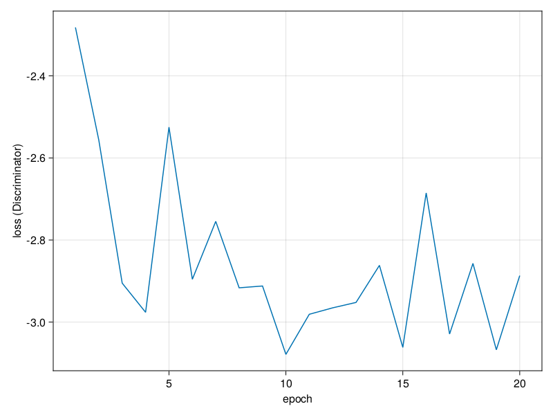

# ECEI Generative

This repository implements [CatGAN](https://arxiv.org/abs/1511.06390) by J. Springenberg.
A reference implementation for training on the MNIST dataset is provided in `src/train_catgan_mnist.jl`.
Models for the discriminator and generator are hard-coded. It can be run as

```
julia src/train_catgan_mnist.jl
```

For the hardcoded configuration, generated MNIST digits in the first 20 epochs are


Training for 20 epochs, the loss of the discriminator decreases



The loss of the generator varies only little, but the parameters of the discriminator
are varied in between each evaluation (as they usually do in a GAN), and this is not critical


Class assignments for the MNIST samples are generated by taking the class, as predicted
by the discriminator, with the maximum probability. Then, the
the [normalized mutual information](https://juliastats.org/Clustering.jl/stable/validate.html#Mutual-information-1) between the MNIST labels and true class assignments
seems to increase up to $0.8$


